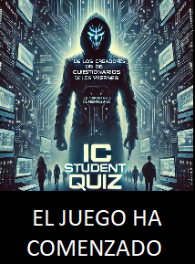

# IC Student Quiz

En estas páginas dispones de varias propuestas de ejercicios para crear preguntas de los tipos 'Respuesta corta' y 'Regular expression short answer' para el 'IC Student Quiz' de Moodle.

Elige en el menú lateral el tipo de ejercicio que quieras crear y sigue las instrucciones indicadas.

Los ejercicios tendrán incorporado un teclado que facilitará la generación de la respuesta en el [formato](https://drive.google.com/file/d/1E9tIScRiF2M2ldZ_VFMrby-MuypGcfVO/view) adecuado.

|  | <iframe 
  src="https://drive.google.com/file/d/13g6vsv0FgCinb1v43ZtrGR6Sx2zJ3v1R/preview"
  width="640" 
  height="360" 
  allow="autoplay">
</iframe> |
